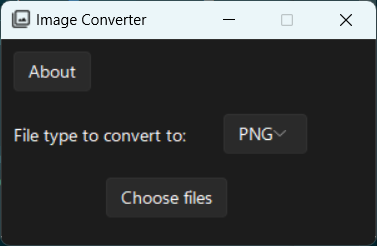
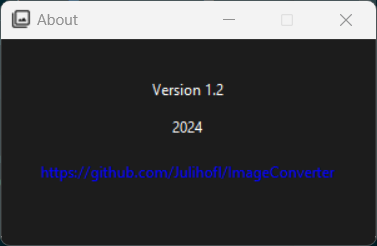

# ImageConverter

 

## Features

<table>
  <tr>
    <th>Convert from</th>
    <th>Convert to</th>
  </tr>
  <tr>
    <td>
      HEIC, JPEG, JPG, WEBP, BMP, ICO, SVG, PNG, TIF, PDF
    </td>
    <td>
      JPEG, WEBP, BMP, ICO, PNG, PDF
    </td>
  </tr>
</table>

## Setting up

```
pip install -r requirements.txt
```

* Installing ImageMagick

```
https://imagemagick.org/script/download.php
```

## Running

```
python main.py
```
